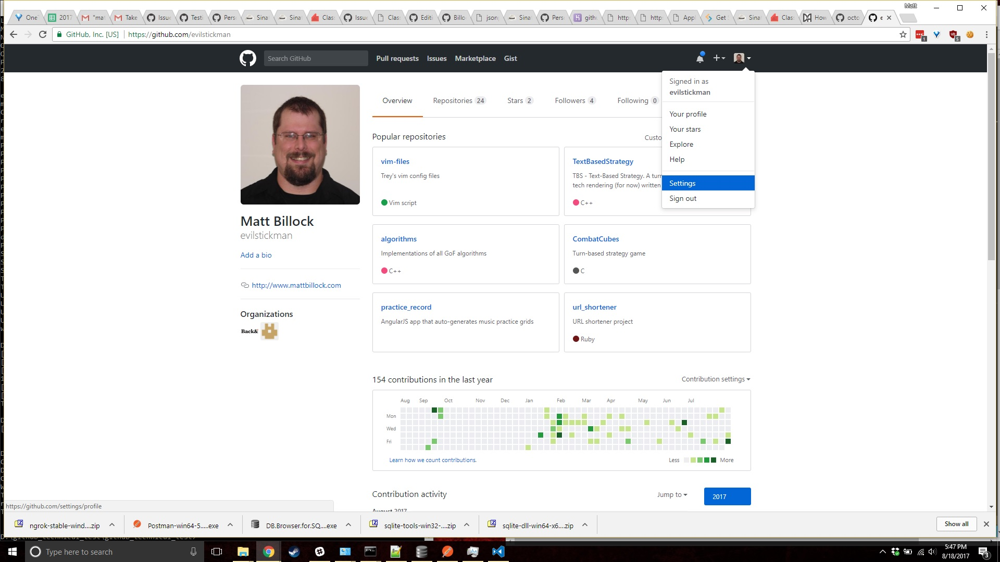
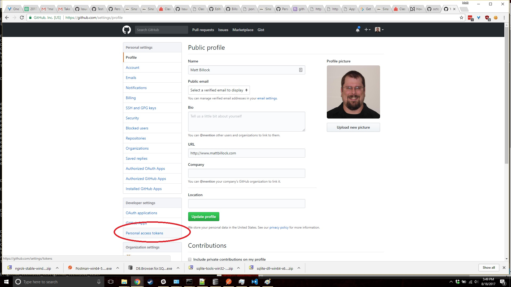
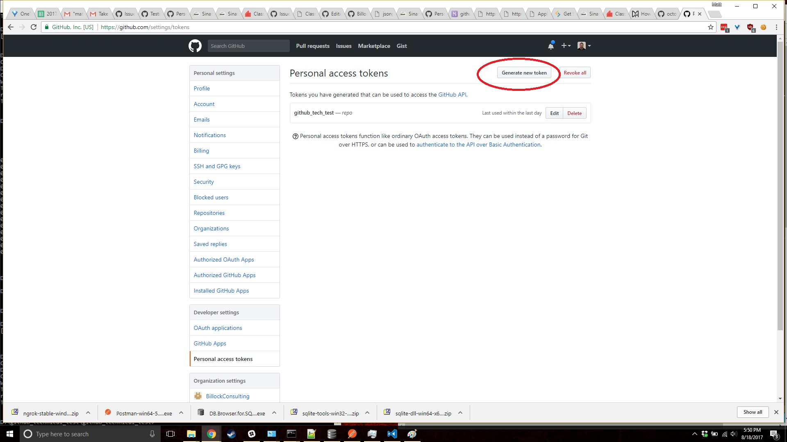
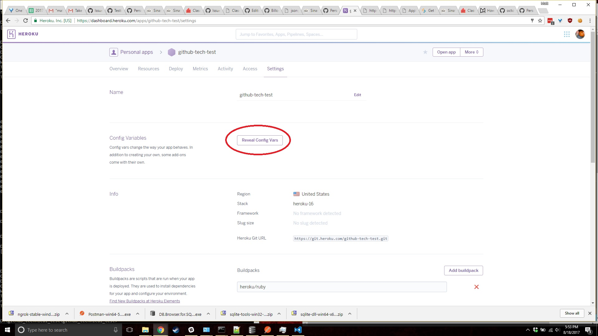
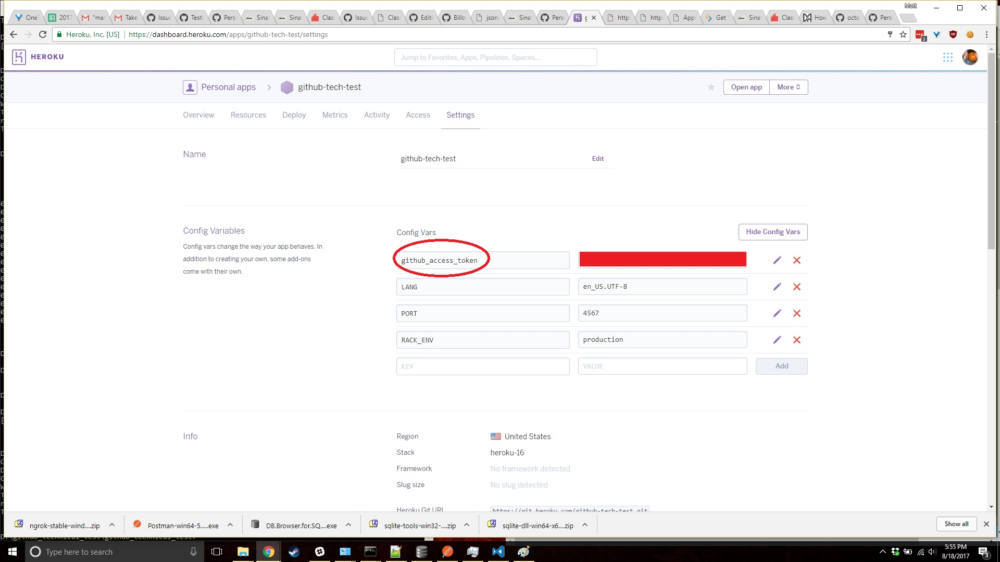
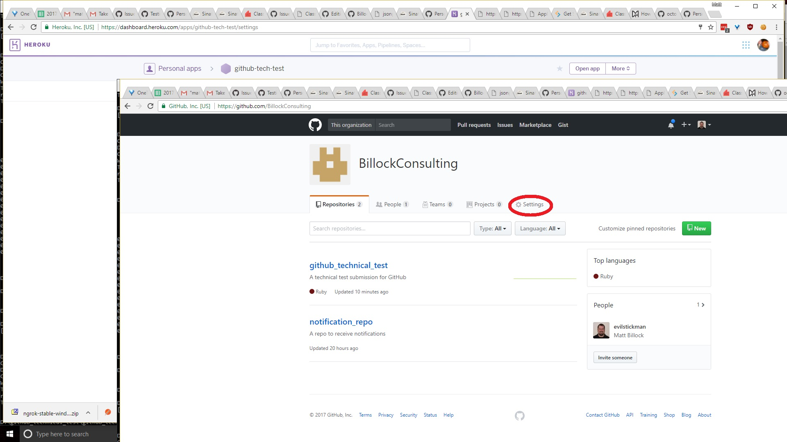
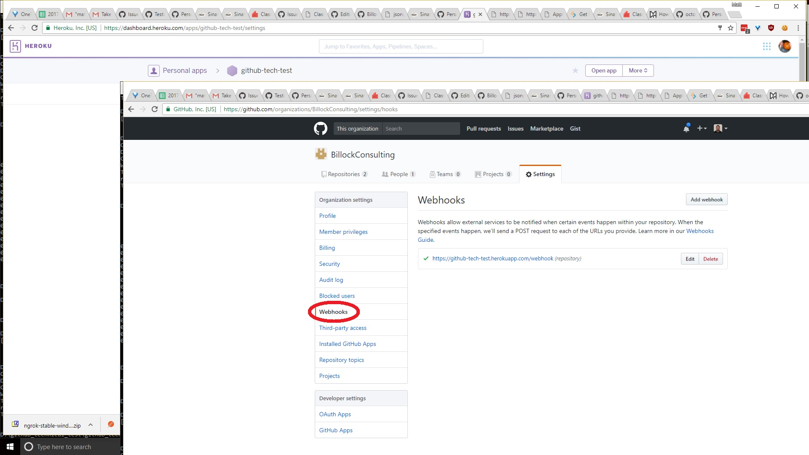

# Matt Billock's GitHub Tech Test submission
This is my submission for GitHub's technical test. Below are notes on the application, and instructions on what is necessary to configure webhooks and deploy this webhook response handler for the organization.

## Application structure

The application is a simple Sinatra app. It has a single endpoint - `/webhook` - which handles incoming repository webhooks from GitHub. The `webhook` endpoint examines the type of webhook, and if it is a "deletion" webhook the webhook is converted into an issue on the repository https://github.com/BillockConsulting/notification_repo. This is an empty repo whose sole purpose is to receive issue creations from this webhook service.

It uses Octokit (https://github.com/octokit/octokit.rb) to communicate with GitHub. I opted to do this to provide a more readable way of communicating with the API, and prevent me from needing to deal with the authentication headers, but if you like I can rewrite the code to use 'net/http' instead so that you can see that I have the capability to construct a web request from scratch.

There are 11 unit tests that express the functionality of the webhook responder service. They are written using RSpec - you can run them from the project directory with "bundle exec rspec".

This project uses Bundler to manage gem dependencies. Be sure to run `bundle install` from the project directory prior to running the code.

This project was also developed on windows. Apologies for the line endings, or anything else odd introduced due to this tech choice - I do not own a personal macbook, and did not have the free space to set up a VM to do development on.

## Environment and Responses

The application has one environment variable dependency - `github_access_token`. This needs to be defined prior to running the application. It expects a personal access token from github, which is created on a user account. I do not know if this approach works for your needs, particularly since the personal access token needs to be tied to a user with appropriate permissions to create issues in the repo/org. I am sure you know more about this than I do, though. If this approach doesn't work, let me know and I will rewrite it to use an application ID and secret key instead.

Responses are empty by choice - I think it represents a security risk to provide too much detail on application errors. That being said, if you had another response structure in mind, I am happy to modify the code. The code can respond as follows:

* `webhook` endpoint, repository creation - responds with 200 OK
* `webhook` endpoint, repository deletion - responds with 200 OK and creates an issue in the repository specified by the code
* `webhook` endpoint, when an error occurs - responds with 500 and logs a message using `logger.error`
* any other endpoint results in a 404

I hard-coded the username to assign the issue to, and the repo to hold the issue. The organization, and the deleted repo name, are pulled from the webhook body. The hardcoded values are available as class constants in file lib/github_communicator.rb. If you like, I can easily rewrite this to use additional environment variables and make this code more flexible.

## Development environment

This application was developed on Microsoft Windows 10 using Visual Studio Code, and the command line. Unit tests are written in RSpec. Sinatra was used to quickly create a web API.

# Application Prerequisites

This project depends on Ruby and Sinatra, using the Bundler gem to manage dependencies.

* To install ruby, follow the instructions at https://www.ruby-lang.org/en/documentation/installation/ for your platform. This application was written against Ruby version 2.4.1p111 for Windows
* Once Ruby has been installed, install the Bundler gem using `gem install bundler` from the command line
* Once Ruby and bundler have been installed, install application dependencies by entering `bundle install` from the command line

## Environment variables

You'll need the following environment variables to configure the application:

* `github_access_token` - this needs to be a valid personal access token for the repo and organization with which you will be working
* `PORT` - this is an optional port specification that can be provided for the webserver. Useful only on Heroku, or if using Rack locally with `config.ru`

# Deployment instructions
The following deployment instructions use Heroku as the medium. The app is live, and can be tested at https://github-tech-test.herokuapp.com/ 

To deploy the code, follow these steps:

## Step 1 - Deploy code to Heroku
Using whichever means you prefer, deploy the code to a heroku app. I used the github integration to tie it in with my personal user - I do not know if this will work for your use case as you'll be evaluating this as a collaborator. If you have any issues with getting this access, let me know and I can promote you to an organization admin, which should resolve that problem.

Once you've deployed the code, you'll need to configure a personal access token.

## Step 2 - Obtain a personal access token
From the github account menu (upper right hand corner of the screen), select "settings":

From the "Settings" menu, select "Personal access tokens"

Once on the Personal Access Tokens page, select "Generate new token"

Once the token is generated, copy the resulting 40 character string - this is the access token used by the application.

## Step 3 - Add the access token to heroku's environment variables.
Next, log in to the heroku dashboard, and navigate to the "Settings" page for your application, and click "Reveal config vars" to reveal and edit environment variables for your app:

Add the new environment variable `github_access_token`, provide the value you copied from Step 2 in the value column, and press "add". The resulting list will look like this:

## Step 4 - Configure webhooks for the organization to point at your heroku app
This final step connects the github webhooks to the heroku instance hosting the Sinatra app we've just created. Start by accessing the organization settings on the "settings" tab of the organization's home page:

Navigate to the "Webhooks" section:

Select "Add Webhook", and configure the webhook with the following:

* **Payload URL** - The URL for your heroku app, **including the "/webhook" path**
* **Content type** - application/json
* Under **Which events would you like to trigger this webhook?**, check *only* the box for `Repository`

Then click "Add". Your webhook should now be active. You can test it by creating and deleting a repo in the BillockConsulting organization. The repo deletion will result in a new issue created in the repo https://github.com/BillockConsulting/notification_repo

# Deploying to something other than Heroku

The web application is built as a Sinatra app. You can deploy it using any application middleware or dev server you like. Here are a few examples:

## Testing on Localhost
(Instructions adapted from https://developer.github.com/webhooks/configuring/)

To test on localhost, you'll first need to install the application. Open the command line, navigate to the directory you wish to work in, and run `git clone https://github.com/BillockConsulting/github_technical_test.git`

*Note*: The above uses HTTPS for cloning. If you have a valid SSH connection to the repo, change the URL to `git@github.com:BillockConsulting/github_technical_test.git`

Once the code is locally installed, you'll need to install the prerequisites mentioned above - Ruby and Bundler. Follow those instructions to install the Ruby programming language, the Bundler gem, then to install the gempack for the application.

Once the application is ready, you can run the command `rspec` to make sure everything is correctly configured. All tests should pass.

At this point, you'll need to specify the `github_access_token` environment variable - do so using a command like the following:

`set github_access_token = {your github access token string}`

This command will vary based on your operating system and CLI provider.

Now that the access token is configured, you can start the Sinatra application using `ruby webhook_responder.rb` from the application root directory. This will start the development webserver.

*Note*: This will only run on your local machine, and as such you need to make sure the relevant port is allowed through your firewall. You'll also need to update the webhook configuration to point at your machine's IP, or use a tool like `ngrok` to open a programmatic hole. Review https://developer.github.com/webhooks/configuring/ for more information on this process.

## Testing against a live webserver (nginx)

Deploying to a webserver (say an EC2 instance running Ubuntu and nginx) is a fairly straightforward process. The nginx team offers a handy guide on tying nginx together with a Sinatra app using Phusion Passenger as the application server - the following instructions are sourced from their extremely useful document at https://www.phusionpassenger.com/library/deploy/nginx/deploy/ruby/

### Install the application on your webserver

Start by pulling down the source code into a folder on your webserver. This will be dependent on your machine, so simply use `git clone https://github.com/BillockConsulting/github_technical_test.git` in the appropriate location. 

### Define environment variables for the webserver's user

The webserver is going to run within the context of a specific user. Update this user's `.bashrc` or `.bash_profile` to create the environment variable `github_access_token` - ensure that this environment variable contains the correct access token for the application.

### Configure nginx to point to the correct location

Edit your application's conf file (usually located in `/etc/nginx/nginx.conf`) to direct requests to the ruby application that represents your webhook processing code. This will consist of two steps:

1 - Configure nginx to pass control to Phusion Passenger to run the ruby application
2 - Configure Phusion Passenger to correctly call the ruby application. This simply consists of specifying the correct Ruby runtime path, and then configuring the application server to point at your code directory.

Once the above two items are complete, Phusion Passenger will use `config.ru`, which is located in the application's root directory, to invoke the Sinatra app for each request. You can specify a `PORT` environment variable to change the port on which your application will respond.

# Verifying functionality
To test this code in a live environment, follow these steps:

* Create a new repository under "Billock Consulting"
* Delete this new repository after it has been created
* View the issues page for https://github.com/BillockConsulting/notification_repo (https://github.com/BillockConsulting/notification_repo/issues)

# Resources used

* https://developer.github.com/webhooks/ - Github's webhook documentation
* https://www.phusionpassenger.com/library/deploy/nginx/deploy/ruby/ - Deploying Ruby on nginx using Phusion Passenger as an application server
* https://developer.github.com/v3/ - Github developer documentation
* https://github.com/octokit/octokit.rb - OctoKit Github API Wrapper. I used the Ruby gem version to simplify web communications

# Caveats
* Many things are hard-coded here, as the problem statement I received via email indicated that I was to be working exclusively with repos and organizations under my control. In a true work setting, I would clarify this requirement.
* Error reporting, security, and logging are largely not implemented for this task. The problem statement did not seem to indicate that these were necessary.
* I have several other companies moving very quickly, and I wanted to get this in as soon as possible - as a result, there were a few cases where I didn't devote significant effort (such as the aforementioned hardcoded values, and the error reporting/security/logging, and so forth). If you'd rather I take the additional time to implement these features, I am happy to do so - simply let me know either through email, a quick call, or by opening issues on this repository.
* You can wire this up to any github account by modifying the value on line 6 of `lib/github_communicator.rb`. 
* To adjust the target notification repo, change line 9 of `lib/github_communicator.rb` to reflect the target repo to receive notifications. Note that I pull the organization and deleted repo name from the webhook, so the notification repo needs to exist in the organization - if this is not the case, the request will result in a 500 error
* I used OctoKit to simplify communications (I mostly didn't want to deal with the auth sequence, in the interest of time).
* I used the `assignee` paramter in creating the issue, in addition to the `@` mention requested. The `assignee` method is noted as being deprecated - if you like I can modify the code to fetch user details from the `users` endpoint and use this in the `assignees` array parameter instead

I am happy to update this to address any shortcomings or answer any issues. I hope this meets your needs, and I am very interested in working with GitHub. Have a great weekend!
